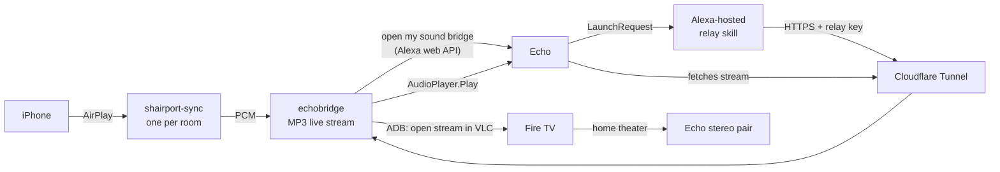

# echobridge

**AirPlay from your iPhone to Amazon Echo speakers.** Pick "Kitchen" in the AirPlay menu of any app
(Apple Music, Podcasts, Spotify, YouTube…) and the sound comes out of your Echo, about 2 seconds behind.
The iPhone volume buttons control the Echo.

[](https://github.com/azarucha/echobridge/actions/workflows/test.yml)


> **Unofficial hobby project.** Not affiliated with, endorsed by or supported by Amazon or Apple. It relies on
> unofficial interfaces that can break at any time. For personal use in your own home. No support, see below.

## Why

Echo speakers can't do AirPlay, and Apple Music on an Echo is voice-only. The usual workarounds are Bluetooth
(one phone, one speaker, gone when you leave the room) or buying different speakers. echobridge turns a small
Linux box in your home (Raspberry Pi, NAS, old laptop) into one AirPlay receiver per room.

## Features

- **One AirPlay receiver per room**, shown by name in the iPhone's AirPlay menu
- **Real audio from any app**, not a "search the same song on Alexa" trick, so it works with a single-device
  Apple Music plan
- **~2 s latency** for start, pause and skip (AirPlay's own 2 s buffer is mostly removed)
- **iPhone volume buttons** change the Echo's volume (relative, configurable step)
- **Stereo in a Fire TV home theater**: the custom skill only plays on one speaker of a home theater pair, so
  echobridge can play the room through VLC on the Fire TV instead, which the home theater spreads in stereo
- **Combined rooms** ("Everywhere"): one receiver that plays on several rooms at once, with an adjustable offset
  to keep skill and Fire TV in sync
- No inbound ports on your router: the Echo reaches the stream through a tunnel (e.g. Cloudflare Tunnel), and
  Amazon reaches your box through a tiny Alexa-hosted relay skill

## How it works



1. Every room runs its own [shairport-sync](https://github.com/mikebrady/shairport-sync) instance that writes raw
   audio to echobridge. echobridge encodes it to an MP3 live stream with ffmpeg.
2. When the iPhone starts playing, echobridge tells the room's Echo "open my sound bridge" through the
   unofficial Alexa web API ([alexa-remote2](https://github.com/Apollon77/alexa-remote)).
3. Your private custom skill answers with `AudioPlayer.Play` and the stream URL, and the Echo plays it.
   The skill is Alexa-hosted and only forwards requests to echobridge (`skill/lambda/index.js`).
4. Volume button presses arrive as shairport-sync volume events and become Echo volume changes.
5. A minute after AirPlay stops, echobridge pauses the Echo.

## Requirements

- An always-on Linux machine in your network (tested on Debian 12 / DietPi, x86). Node.js 20+.
- shairport-sync with the `stdout` backend and metadata support (tested with 5.5), avahi, ffmpeg, adb
  (only for Fire TV), gcc (for a small port fix)
- An Amazon account with Echo devices and a free Amazon developer account (for the private skill)
- A public HTTPS address that forwards to echobridge's skill port, e.g. a free
  [Cloudflare Tunnel](https://developers.cloudflare.com/cloudflare-one/connections/connect-networks/) on your domain
- iPhone, iPad or Mac (any AirPlay sender)

## Setup

The short version, details in **[docs/setup.md](docs/setup.md)**:

```bash
git clone https://github.com/azarucha/echobridge.git && cd echobridge
sudo ./deploy/install.sh
sudo nano /etc/echobridge/echobridge.env      # HOST_IP, AMAZON_PAGE, PUBLIC_URL
sudo systemctl start echobridge
sudo echobridge status                         # shows the Amazon sign-in link on first start
sudo echobridge devices                        # serial numbers for ROOMS
```

Then create the private skill ([docs/alexa-skill.md](docs/alexa-skill.md)), fill in `ROOMS`, `SKILL_ID` and
restart. Optional: [stereo through a Fire TV home theater](docs/fire-tv.md).

## Command line

```
echobridge status                 Amazon login, receivers, streams, recent events
echobridge devices                Alexa devices with serial numbers
echobridge skill-code             Code for the Alexa-hosted skill, with your URL and relay key
echobridge sync <room> <ms>       Align skill and Fire TV in a combined room
echobridge launch <serial> [room] Open the skill on an Echo by hand
echobridge firetv-pair <ip>       Connect to a Fire TV via ADB
```

## Limitations

- **Latency ~2 s** (Fire TV path a bit more). Fine for music and podcasts, not for video.
- **One stream per room.** AirPlay 1 receivers can't be grouped in the iPhone menu, hence combined rooms.
- **Unofficial Amazon login.** Amazon changes its login from time to time; then alexa-remote2 needs an update
  and you sign in again. The audio path itself (skill + stream) uses official skill interfaces.
- **The skill stays private** (development stage, your account only). Public certification is unlikely for a
  skill that streams arbitrary audio, so everyone creates their own (10 minutes, free).
- In a Fire TV home theater, switching the TV off while playing stops VLC. Start AirPlay again (it works with
  the TV off).

More in [docs/troubleshooting.md](docs/troubleshooting.md).

## Support

This is a personal project I share as is. Issues with a clear description are welcome, pull requests even more,
but I can't promise answers or fixes. If echobridge is useful to you, you can buy me a coffee
(see the Sponsor button).

## Credits

[shairport-sync](https://github.com/mikebrady/shairport-sync) by Mike Brady,
[alexa-remote2](https://github.com/Apollon77/alexa-remote) by Apollon77, [FFmpeg](https://ffmpeg.org),
[VLC](https://www.videolan.org). "AirPlay" is a trademark of Apple Inc., "Amazon Echo", "Alexa" and "Fire TV"
are trademarks of Amazon.com, Inc. or its affiliates.

## License

[MIT](LICENSE)
